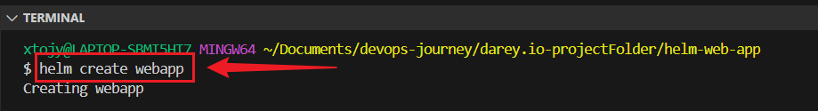

# 🚀 Helm Chart Customization Project

This project demonstrates how to deploy a simple web application to a Kubernetes cluster using **Helm**, a powerful package manager for Kubernetes. It includes the setup of Helm, customization of a Helm chart, and deployment of the application.

---


## 📦 Project Overview

This project helps you:

- Understand Helm charts, values, and templates.
- Customize a Helm chart to deploy Nginx.
- Set resource requests and limits.
- Install and verify your deployment in Kubernetes.

---

## 🧰 Prerequisites

Make sure you have the following installed:

- [Helm](https://helm.sh/docs/intro/install/)
- [kubectl](https://kubernetes.io/docs/tasks/tools/)
- A running Kubernetes cluster (like Minikube, Docker Desktop, or a cloud-based cluster)
- Git
- VS Code or any text editor

--- 

## 📁 Project Structure
```
webapp/ ├── Chart.yaml ├── values.yaml └── templates/ └── deployment.yaml
```

---


## Verify installation:
```
helm version
```


---

## : Create a new project directory:
```
mkdir helm-web-app
cd helm-web-app
```


---

## 1: 🛠️ Create a Helm Chart
```
helm create webapp
```


---


## 2: Modify values.yaml
Edit **values.yaml** and update the following values:
```
replicaCount: 2

image:
  repository: nginx
  tag: stable
  pullPolicy: IfNotPresent
```


3. Customize the Deployment Template
Open templates/deployment.yaml and find this line:
```
{{- toYaml .Values.resources | nindent 12 }}
```
Remove it, and replace it with this:
```
resources:
  requests:
    memory: "128Mi"
    cpu: "100m"
  limits:
    memory: "256Mi"
    cpu: "200m"
```
**This sets the resource usage for your app.**


### Create a New GitHub Repository
```
helm-web-app-2
```

## 3: Initialize Git:
```
git init
git add .gitignore
git add .
git commit -m "Initial Helm chart"
```

## Push to remote repository:
```
git remote add origin <REMOTE_REPOSITORY_URL>
git push -u origin master
```

---


## ✅ Conclusion
This project shows how Helm can simplify Kubernetes application deployments through templated configuration and version-controlled charts. Helm does not only helps maintain consistency across environments but also empowers teams to deploy and manage applications at scale with confidence.
